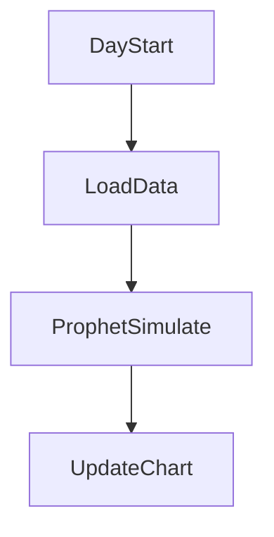

# 🔄 OmniPOS360 — AI-Enhanced POS System Simulation


> 🧠 *A real-time, AI-enhanced POS experience for restaurants and retailers—built to impress Technical Program Managers and AI-first leaders.*

---

## 📚 Table of Contents

- [🚀 Overview](#-overview)
- [⚙️ Features](#️-features)
- [📐 Architecture](#-architecture)
- [🧠 AI Modules](#-ai-modules)
- [🧩 Tech Stack](#-tech-stack)
- [📊 Business Use Case](#-business-use-case)
- [📎 Mermaid Diagrams](#-mermaid-diagrams)
- [📁 File Structure](#-file-structure)
- [📲 Getting Started](#-getting-started)
- [📄 License](#-license)

---

## 🚀 Overview

**OmniPOS360** is a full-featured Point of Sale (POS) simulation built in **React Native** using **Expo**, designed to show how modern AI/ML capabilities can power up business operations, sales forecasting, and fraud detection—at the edge and in real time.

It's modular, offline-first, and built for stakeholder storytelling.

---

## ⚙️ Features

- 🔐 Role-based login (Admin, Manager, Cashier)
- 🛒 Product catalog & cart logic
- 🧾 QR/barcode scanner + mock printer logic
- 📶 Offline-first sync queue
- 📈 Live dashboards with AI-simulated metrics
- 🌍 Expo + Web + Mobile support

---

## 📐 Architecture

```mermaid
flowchart TD
    UI[React Native UI] --> API[Simulated REST API (Node.js/Firebase)]
    API --> DB[(Firebase / Supabase)]
    DB --> AI[Embedded AI Logic]
    AI --> Dashboard[Realtime React Dashboard]
    subgraph Device
      UI
    end
````

---

## 🧠 AI Modules

1. **Sales Forecasting**

   * Based on historical mock data
   * UI toggle to enable/disable
   * Triggers real-time prediction updates

2. **Fraud Detection**

   * Simulated Isolation Forest logic
   * Flags anomalies over a certain threshold

3. **Customer Clustering**

   * K-Means logic on historical sales
   * Groups visualized by behavior types

---

## 🧩 Tech Stack

* **Frontend:** React Native + TailwindCSS
* **Backend:** Firebase / Node.js (Simulated APIs)
* **AI Logic:** `prophet`, `isotree`, `kmeans` (simulated with JSON)
* **DevOps:** GitHub Actions + optional Docker

---

## 📊 Business Use Case

📌 **If I were the TPM for a 17-location rollout**, I’d focus on:

* Ensuring sales don’t halt during outages (offline queue)
* Scaling inventory sync via Firebase triggers
* Using AI forecasts to plan staffing and prep
* Monitoring for transaction fraud centrally
* Quickly onboarding employees via role-based UI

💡 Add-on: Custom Notion playbook titled:

> “17-Store AI POS Deployment: Timeline, Risk, and Value Storytelling”

---

## 📎 Mermaid Diagrams

### AI Fraud Flow

```mermaid
graph TD
A[New Transaction] --> B{Exceeds Threshold?}
B -- Yes --> C[Flag as Anomaly]
B -- No --> D[Approve]
```

### Sales Forecasting



---

## 📁 File Structure

```
OmniPOS360/
├── /assets/
├── /components/
│   ├── Login.js
│   ├── ProductList.js
│   ├── Cart.js
│   └── AIChart.js
├── /data/
│   ├── mock_sales.json
│   └── fraud_flags.json
├── /screens/
│   ├── Dashboard.js
│   └── Inventory.js
├── App.js
└── README.md
```

---

## 📲 Getting Started

1. Clone the repo:

   ```bash
   git clone https://github.com/yourname/OmniPOS360.git
   cd OmniPOS360
   ```

2. Install dependencies:

   ```bash
   npm install
   ```

3. Run the project:

   ```bash
   npx expo start
   ```

---

## 📄 License

This project is licensed under the MIT License.

---

> Made with ⚡ and caffeine by **Erwin Maurice McDonald** — built for innovation storytelling and technical fluency.

```

Let me know if you'd like a downloadable Notion page or sample `.json` files to accompany the AI logic!
```
